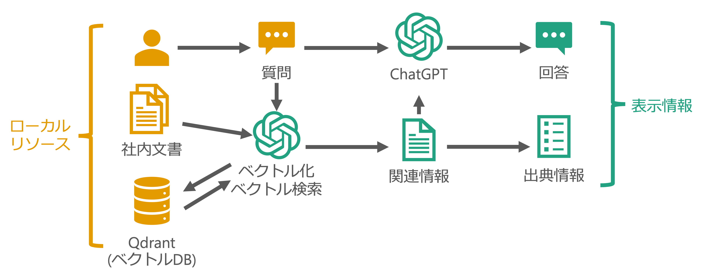

# KadaGPT アプリ用マニュアル
## 概要
本アプリは，chatGPTを始めとするLLMや自然言語処理を用いて組織内文書を検索，質問に対する応答を生成することで，オフィスワークを支援することを目的に開発中です．現在基本的な質問応答処理，必要な関連情報の部分選択処理を実装しています．

## 構成図
### 動作概要

アプリは文書登録タスクと質問タスクに分けられます．それぞれ以下のようなフローになります．

#### 文書登録
1. 文書をOpenAIの提供するモデルを使ってEmbedding(ベクトル化)する．
1. Embeddingした文書をベクトルDBに保存する．

#### 質問
1. 質問をOpenAIの提供するモデルを使ってベクトル化する．
2. ベクトル情報を使って，ベクトルDB内を検索し，関連情報をとってくる．
3. 質問と関連情報を組み込み，引用情報を提示するよう指示したプロンプトをChatGPTに投げる．
4. 回答を取得し表示する．
5. 回答より，使用したpdfファイルを引用として表示する．

### サーバ構成
dockerコンテナとしてバックエンド側ではFastAPIコンテナ，Qdrantコンテナ，DBコンテナ，Nginxコンテナが，フロントエンド側ではNext.jsコンテナおよびKeycloakコンテナが動作しています．FastAPIへの直接アクセスには，サーバの8080ポートにアクセスします．
フロントエンドを用いた対話では，ブラウザから`http://サーバIP:3000`にアクセスします．

## 技術要件
### 必要マシンスペック
- CPU: スペック不問
- dGPU: 必要無し
- RAM: 8G以上
- ディスク: 10GB以上
### 必要ソフトウェア
- OS: Dockerが動けばOK
- コンテナツール: Docker
### その他
- インターネットに接続できること
  - dockerでイメージをビルドするため
  - OpenAI APIに問い合わせるため
    - api.openai.comに接続する

## 使い方
### セットアップ
我々が直接セットアップさせていただければと思います．
文書ファイルの一括投入や初期ユーザの作成，動作確認などを行います．

### ブラウザ経由のチャットを行う

1. 動かしているサーバのIPアドレスの3000番ポートにブラウザからアクセスします．
1. 右上に`LOGIN`と表示されているので，予め与えられたユーザIDとパスワードでログインします．
1. 左のメニューからスレッドを作成します．
1. スレッド作成時には，スレッド名とChatGPTのモデル，関連文書取得数，知識ベース(コレクション)選択，手法の選択を行います．
1. スレッド作成後は，ChatGPTがコレクションに登録した知識を使って応答する対話を利用できます．

## サポート情報
もし不具合などが発生しましたら，現地あるいはSSH経由にて対処させていただきます．  
連絡先はこちら
- 増田嶺(香川大学) s20t331@kagawa-u.ac.jp
- 岩本和真(香川大学) s20t301@kagawa-u.ac.jp
- 道信祐成(香川大学) s20t333@kagawa-u.ac.jp

いつでもメンテナンスできるよう，SSH用のポートを外部へ開けていただけると幸いです．
